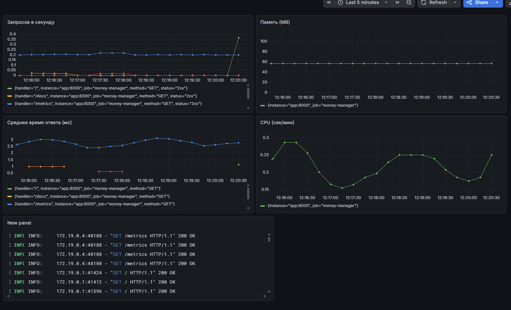

# Money Manager — DevOps Practice Project

Краткое описание
-
Проект "Money Manager" - учебный проект для отработки практик DevOps и Observability. Включает простое REST API на FastAPI с PostgreSQL, контейнеризацию через Docker, оркестрацию сервисов через Docker Compose, сбор метрик Prometheus, логирование через Loki/Promtail и визуализацию в Grafana. Набор CI/CD workflow реализован в GitHub Actions.

Что реализовано
-
- Контейнеризированное приложение на Python (FastAPI) с `Dockerfile`.
- Описание мультисервисной архитектуры в `docker-compose.yml`: сервисы `app`, `db`, `prometheus`, `grafana`, `loki`, `promtail`.
- Бизнес-логика: API для добавления транзакций и получения статистики (`main.py`) и CLI-клиент (`cli.py`).
- Подключение к PostgreSQL (образ `postgres:15`) с томом для данных.
- Экспорт метрик через `prometheus-fastapi-instrumentator` и конфигурация Prometheus (`prometheus.yml`).
- Сбор логов контейнеров через Promtail и хранение/поиск логов в Loki (конфиги `promtail-config.yaml`, `loki-config.yaml`).
- Provisioning Grafana datasource (`grafana/datasources.yml`) для Prometheus и Loki.
- CI: синтаксическая проверка и интеграционные шаги (`.github/workflows/ci.yml`).
- CD: сборка и пуш Docker-образа в Docker Hub (`.github/workflows/cd.yml`).

Ключевые файлы
-
- `Dockerfile` — билд образа приложения на Python 3.11.
- `docker-compose.yml` — описание стека сервисов и томов.
- `main.py` — FastAPI приложение, модели и простая логика работы с БД.
- `cli.py` — простой CLI для взаимодействия с API.
- `prometheus.yml`, `loki-config.yaml`, `promtail-config.yaml` — конфигурации мониторинга и логирования.
- `grafana/datasources.yml` — provision datasource для Grafana.
- `.github/workflows/ci.yml`, `.github/workflows/cd.yml` — CI/CD pipelines.

Как запустить (локально)
-
1. Установите Docker и Docker Compose.
2. В корне проекта выполните:

```
docker compose up -d --build
```

3. Доступные интерфейсы:
- API: `http://localhost:8000/` - корень; `http://localhost:8000/docs` - Swagger UI, `http://localhost:8000/metrics` - перечень метрик.
- Prometheus: `http://localhost:9090`
- Grafana: `http://localhost:3000`.

API endpoints
-
- `POST /transaction` — добавить транзакцию (JSON: `amount`, `category`, `card_name`).
- `GET /stats` — агрегированная статистика по картам.
- `GET /cards/recommend?category=...&amount=...` — простая рекомендация карты.

CI / CD
-
- CI (`.github/workflows/ci.yml`): проверка синтаксиса Python, интеграционный сценарий, поднимающий стек через `docker compose` и проверяющий доступность сервисов.
- CD (`.github/workflows/cd.yml`): сборка и пуш Docker-образа в Docker Hub (использует секреты `DOCKER_USERNAME` и `DOCKER_TOKEN`).


Grafana

